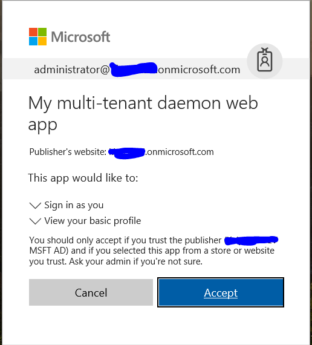
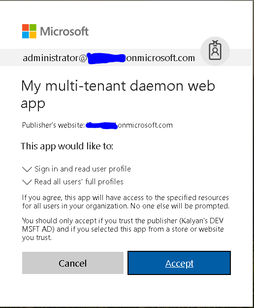

# Build a multi-tenant daemon with the v2.0 endpoint
## About this sample
This sample application shows how to use the [Azure AD v2.0 endpoint](http://aka.ms/aadv2) to access the data of Microsoft business customers in a long-running, non-interactive process.  It uses the OAuth2 client credentials grant to acquire an access token which can be used to call the [Microsoft Graph](https://graph.microsoft.io) and access organizational data.

The app is built as an ASP.NET 4.5 MVC application, using the OWIN OpenID Connect middleware to sign-in users.  Its "daemon" component is simply an API controller which, when called, syncs a list of users from the customer's Azure AD tenant.  This `SyncController.cs` is triggered by an ajax call in the web application, and uses the preview Microsoft Authentication Library (MSAL) to perform token acquisition.

## Scenario
Because the app is a multi-tenant app intended for use by any Microsoft business customer, it must provide a way for customers to "sign up" or "connect" the application to their company data.  During the connect flow, a company administrator can grant **application permissions** directly to the app so that it can access company data in a non-interactive fashion, without the presence of a signed-in user.  The majority of the logic in this sample shows how to achieve this connect flow using the v2.0 **admin consent** endpoint.

For more information on the concepts used in this sample, be sure to read the [v2.0 endpoint client credentials protocol documentation](https://azure.microsoft.com/documentation/articles/active-directory-v2-protocols-oauth-client-creds).

> Looking for previous versions of this code sample? Check out the tags on the [releases](../../releases) GitHub page.

## How To Run this Sample

To run this sample you will need:
- [Visual Studio 2017](https://aka.ms/vsdownload)
- An Internet connection
- An Azure Active Directory (Azure AD) tenant. For more information on how to get an Azure AD tenant, please see [How to get an Azure AD tenant](https://azure.microsoft.com/en-us/documentation/articles/active-directory-howto-tenant/) 
- One or more user account in your Azure AD tenant. This sample will not work with a Microsoft account (formerly Windows Live account), so if you signed in to the Azure portal with a Microsoft account and have never created a user account in your directory before, you need to do that now. This sample will not work with a Microsoft account.

### Register an app
Create a new app at [apps.dev.microsoft.com](https://apps.dev.microsoft.com), or follow these [detailed steps](https://docs.microsoft.com/azure/active-directory/develop/active-directory-v2-app-registration).  Make sure to:
- Use an identity that will be known by the tenant you intend to use with the application
- Copy down the **Application Id** assigned to your app, you'll need it soon.
- Add the **Web** platform for your app.
- Enter two **Redirect URLs**s. The base URL for this sample, `https://localhost:44316/`, as well as `https://localhost:44316/Account/GrantPermissions`.  These are the locations which the v2.0 endpoint will be allowed to return to after authentication.
- Generate an **Application Secret** of the type **Password**, and copy it for later.  Note that in production apps you should always use certificates as your application secrets, but for this sample we will use a simple shared secret password.

If you have an existing application that you have registered in the past, feel free to use that instead of creating a new registration.

### Configure your app for admin consent
In order to use the v2.0 admin consent endpoint, you'll need to declare the application permissions your app will use ahead of time.  While still in the registration portal,

- Locate the **Microsoft Graph Permissions** section on your app registration.
- Under **Application Permissions**, add the `User.Read.All` permission.
- Be sure to **Save** your app registration.

### Download & configure the sample code
You can download this repo as a .zip file using the button above, or run the following command:

`git clone https://github.com/Azure-Samples/active-directory-dotnet-daemon-v2.git`

Once you've downloaded the sample, open it using Visual Studio.  Open the `App_Start\Startup.Auth.cs` file, and replace the following values:

- Replace the `clientId` value with the application ID you copied above during App Registration.
- Replace the `clientSecret` value with the application secret you copied above during App Registration.

### Run the sample
Start the UserSync application, and begin by signing in as an administrator in your Azure AD tenant.  If you don't have an Azure AD tenant for testing, you can [follow these instructions](https://azure.microsoft.com/documentation/articles/active-directory-howto-tenant/) to get one.

When you sign in, the app will first ask you for permission to sign you in & read your user profile.  This allows the application to ensure that you are a business user.  

The application will then try to sync a list of users from your Azure AD tenant via the Microsoft Graph.  If it is unable to do so, it will ask you (the tenant administrator) to connect your tenant to the application.

The application will then ask for permission to read the list of users in your tenant.  

When you grant the permission, the application will then be able to query for users at any point.  You can verify this by clicking the **Sync Users** button on the users page, refreshing the list of users.  Try adding or removing a user and re-syncing the list (but note that it only syncs the first page of users!).

## About The Code
The relevant code for this sample is in the following files:

- Initial sign-in: `App_Start\Startup.Auth.cs`, `Controllers\AccountController.cs`.  In particular, the actions on the controller have an Authorize attribute, which forces the user to sign-in. The application uses the [authorization code flow](https://github.com/AzureAD/microsoft-authentication-library-for-dotnet/wiki/Acquiring-tokens-with-authorization-codes-on-web-apps) to sign-in the user.
- Syncing the list of users to the local in-memory store: `Controllers\SyncController.cs`
- Displaying the list of users from the local in-memory store: `Controllers\UserController.cs`
- Acquiring permissions from the tenant admin using the admin consent endpoint: `Controllers\AccountController.cs`

## How To Recreate This Sample
### Code for the service
1. In Visual Studio 2017, create a new `Visual C#` `ASP.NET Web Application (.NET Framework)`. In the next screen choose the `MVC` project template. Also add folder and core references for `Web API` as we would be adding a Web API controller later.  Leave the project's chosen authentication mode as the default, i.e. `No Authentication`".
2. Select the project in the **Solution Explorer** window and press the **F4** key to bring project properties. In the project properties, set **SSL Enabled** to be `True`. Note the **SSL URL**. You will need it when configuring this application's registration in the Azure Portal.
3. Add the following ASP.Net OWIN middleware NuGets: `Microsoft.Owin.Security.ActiveDirectory`, `Microsoft.Owin.Security.Cookies` and `Microsoft.Owin.Host.SystemWeb`, `Microsoft.IdentityModel.Protocol.Extensions`, `Microsoft.Owin.Security.OpenIdConnect` and `Microsoft.Identity.Client (preview)`. You will need to check the **Include prerelease** box to obtain the preview version of the `Microsoft Authentication Library (MSAL) Preview for .NET` library.
4. In the `App_Start` folder, create a class `Startup.Auth.cs`.You will need to remove `.App_Start` from the namespace name.  Replace the code for the `Startup` class with the code from the same file of the sample app.  Be sure to take the whole class definition!  The definition changes from `public class Startup` to `public partial class Startup`
5. In `Startup.Auth.cs` resolve missing references by adding `using` statements as suggested by Visual Studio intellisense.
6. Right-click on the project, select Add, select "Class", and in the search box enter "OWIN".  "OWIN Startup class" will appear as a selection; select it, and name the class `Startup.cs`.
7. In `Startup.cs`, replace the code for the `Startup` class with the code from the same file of the sample app.  Again, note the definition changes from `public class Startup` to `public partial class Startup`.
8. In the `Models` folder add a new class called `MsGraphUser.cs`.  Replace the implementation with the contents of the file of same name from the sample.
9. Add a new **MVC 5 Controller - Empty** called `AccountController`. Replace the implementation with the contents of the file of same name from the sample.
10. Add a new **MVC 5 Controller - Empty** called `UserController`. Replace the implementation with the contents of the file of same name from the sample.
11. Add a new **Web API 2 Controller - Empty** called `SyncController`. Replace the implementation with the contents of the file of same name from the sample.
12. For ths user interface, in the `Views\Account` folder, add three **Empty (without model) Views** named `GrantPermissions`, `Index` and `UserMismatch` and one named `Index` in the `Views\User` folder. Replace the implementation with the contents of the file of the same name from the sample. 
13. Update the `Shared\_Layout.cshtml` and `Home\Index.cshtml` to correctly link the various views together.     

## Community Help and Support

We use [Stack Overflow](http://stackoverflow.com/questions/tagged/msal) with the community to provide support. We highly recommend you ask your questions on Stack Overflow first and browse existing issues to see if someone has asked your question before. Make sure that your questions or comments are tagged with [msal.dotnet].

If you find and bug in the sample please raise the issue on [GitHub Issues](../../issues).

If you find a bug in msal.Net, please raise the issue on [MSAL.NET GitHub Issues](https://github.com/AzureAD/microsoft-authentication-library-for-dotnet/issues).

To provide a recommendation, visit our [User Voice page](https://feedback.azure.com/forums/169401-azure-active-directory).

## Contributing

If you'd like to contribute to this sample, see [CONTRIBUTING.MD](/CONTRIBUTING.md).

This project has adopted the [Microsoft Open Source Code of Conduct](https://opensource.microsoft.com/codeofconduct/). For more information see the [Code of Conduct FAQ](https://opensource.microsoft.com/codeofconduct/faq/) or contact [opencode@microsoft.com](mailto:opencode@microsoft.com) with any additional questions or comments.

## More information
For more information see MSAL.NET's conceptual documentation:
- [Recommended pattern to acquire a token in public client applications](https://github.com/AzureAD/microsoft-authentication-library-for-dotnet/wiki/AcquireTokenSilentAsync-using-a-cached-token#recommended-call-pattern-in-public-client-applications)
- [Acquiring tokens ineractively in public client applications](https://github.com/AzureAD/microsoft-authentication-library-for-dotnet/wiki/Acquiring-tokens-interactively) 
- [Customizing Token cache serialization](https://github.com/AzureAD/microsoft-authentication-library-for-dotnet/wiki/token-cache-serialization)
